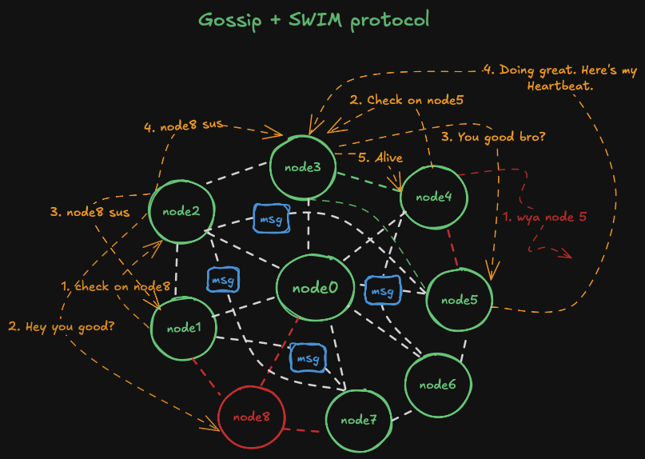

# Decentralized Membership Protocol in Go

This project is an implementation of a decentralized, gossip-based group membership protocol in Go. It enables nodes in a distributed system to maintain a weakly-consistent list of active members without relying on a central server.

## Key Features

- **Decentralized:** No single point of failure; all nodes are peers.
- **Gossip Protocol:** Membership information is disseminated efficiently and robustly throughout the cluster.
- **Failure Detection:** Uses direct pings and indirect probing to reliably detect node failures, making it resilient to network partitions.
- **Fault-Tolerant:** The cluster can gracefully handle nodes joining, leaving, or failing unexpectedly.

## Protocol Visualization



### Running the Cluster

1.  **Build and start the services:**
    ```bash
    docker-compose up --build
    ```
2.  **Simulate network partition:**
    ```bash
    docker exec <name of the node to apply rule to> iptables -A INPUT -s <IP addr of the node to drop packets of> -j DROP
    ```
